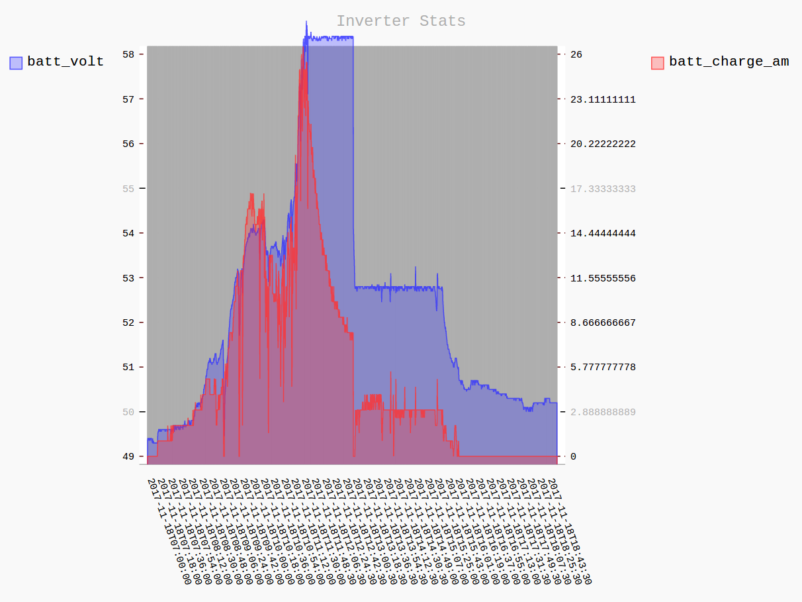
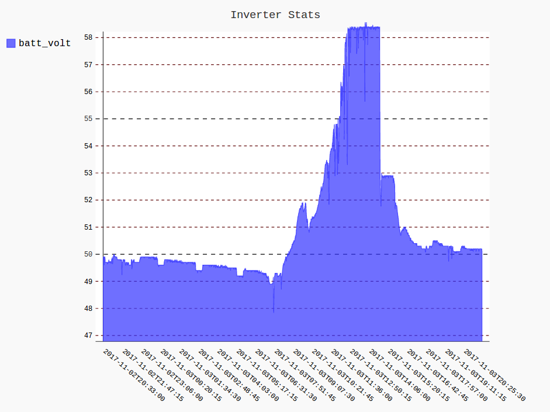
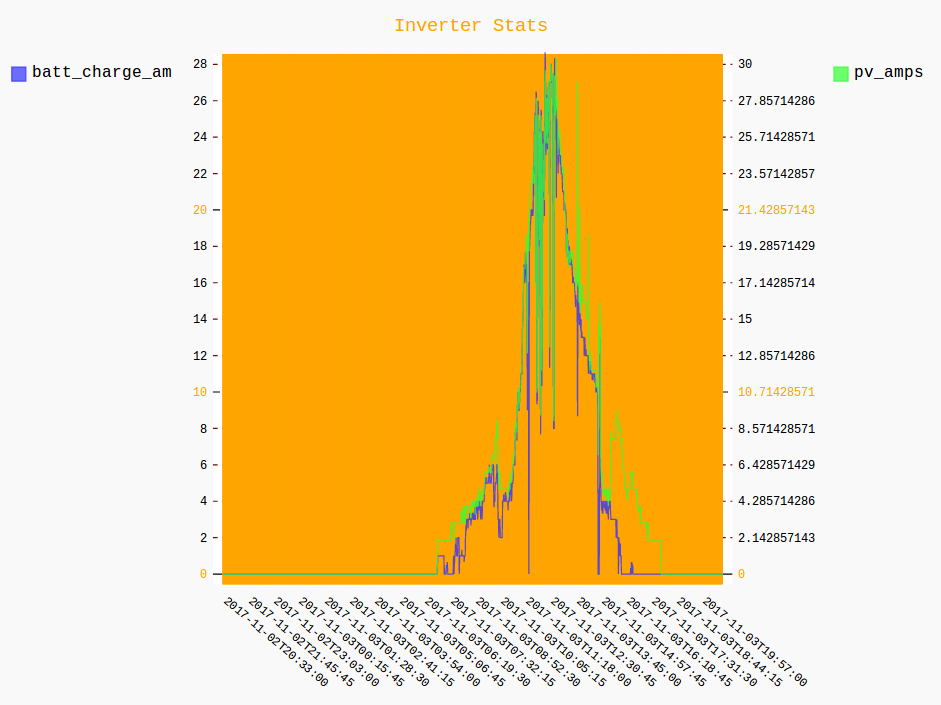

# GODENERG

Atersa / Axpert / Master Power / Voltronics Inverter python library / interface / tool

The idea is to develop a tool that works better that the dubious WatchPower program that
comes with the inverter and improves in practicality by been usable through the network.

The Watchpower is a badly coded piece of Java that works as a GUI tool and has no
network functionality when used with USB or Serial connections.

Godenerg should be usable in a Raspberry Pi and could be left connected
to a house LAN acting as a bridge to the inverter. For instance, right now
I am using Godenerg provide the real-time data I need to display
through HTTP into a Raspberry Pi in my living room that uses a OLED to display
real-time stats.

## Current features:

    * Solid daemon that can be left unsupervised working continuously.

    * Datalogging working.

    * Stats plotting over HTTP working.

    * Real-time data over HTTP working.

    * Charger process implemented and working better than the inverter's original charger.

## TODO:

   * More sophisticated charging

   * Web based, real-time visualization tool (like watchpower but web based)

   * Web based settings setter trough forms (like watchpower but web based)

   * Query interface for datalogger (besides the existing querystring interface).


## Charging:

Besides offering realtime data like WatchPower, this software is intented
to by-pass the big elephant in the room with this inverter, the charger:

 1. The firmware in the inverter has a massive bug that the developers
    are not addressing. When the inverter is charging if the available
    amperage to charge drops below 1/5 of the max charging amperage set
    it stops charging (in less than a minute).
    If you happen to get a couple of clouds and have a rice cooker on,
    for instance, you can forget about getting
    a full charge. The inverter will stay in float voltage and the
    day's charge will be over.

 2. Because of the mentioned bug you have to lower the max charging amperage
    if you want to minimize the issue and if you happen to have quite a bit
    of PV power like I have (3.8KW), you are not using the available energy.

 3. Cloudy days, instead of charging with whatever energy there is (no worries
    for overcharging there), the inverter sits there at float voltage.

 4. They are some patched firmwares that try to address this problems, but
    the are patched firmwares by individuals and no source code is released.
    I could give them a try but I fear bricking the inverter since my only
    means of energy is the PV array.

 5. Latest releases of the official firmware just wait 10 minutes
    before dropping to float voltage instead of under a minute.
    I guess they tried boging a fix but is still not correct.

### To implement a charger from Godenerg:

 - I can dynamically set the float voltage setting.

 - I can monitor the charge amperage and the battery voltage.

 - I can gather stats and analyse the amperage and voltage overtime.

### Therefore:

 1. I can wait for the desired absorption voltage to be reached (bulk phase),
    forcing float voltage to be equals to absorption voltage.

 2. Then I can monitor the average voltage and charge current through time
    as the absorption phase is happening.

 3. When the amperage is low enough I can change the float voltage to the
    real float voltage.

With this mechanics I mimic the desired charging curve of volts vs amps
described in all the charging documentation I find for sealed lead acid batteries.

 
 (graph generated with godenerg:
 `http://host:8890/graph?from=2017111807&to=2017111819&col_2=batt_charge_amps&col_1=batt_volt`)

## Current project status:

    - The USB interface with the inverter is fairly unstable; the firmware
      sometimes fails to properly respond and other times has small hipccups
      so anything connected continuously to the inverter has to be able to
      handle failure.
      The daemon takes care of watching over himself and restarts gracefully
      if any issues happen. The daemon can be left unsupervised and will
      self fix and restart if any problems happen.

    - Python 3 compatible. Just tested on Linux.
      No hope to get it tested on Mac or Windows unless someone helps with that.

    - So far tested on usb connections, whenever I get my hands on a usb to serial adapter
      I will test on serial connections.

    - Project in its infancy, alpha at best but already usable.

    - Charging is crude, is based in time of the day and not dynamic. A lot to refine
      in the charging process.

    - Right now CMD tool is not up to date since I am putting all energies into
      the daemon.

## Current inverter setup:

 - Inverter is an 'Atersa 5KVA-48-PAR-A' model.

 - Absorb voltage is set to max 58.4V

 - Float voltage is set to 52.8 which is what is recommended on the batteries data-sheet.

 - I have 12 x 320W PV panels wired in 4 paralel strings of 3 panels in series.

 - 8 x 6 550 Amps / h sealed maintenance free lead acid batteries.

 - Connecting from debian linux to the inverter using the hidusb interface.

 - Uncompressed the Watchpower JAR and decompiled the source to learn how to
   talk to the inverted along side info found on a couple of forums.

## Testing:
```
 $> pytest -v --pyargs axpert
```

## Run as daemon

```
 $> python3 axpert/main.py --usb -d /dev/hidraw0 --daemon
```

* Datalogger starts up and starts logging QPIGS command into a sqlite 
  database. The loggin interval is configured via the setup file found 
  in the file [axpert/settings.py](axpert/settings.py) inside the 
  dictionary `datalogger_conf`:

  ```python
    datalogger_conf = {
        'db_filename': '/home/ups/godenerg/godenerg.db',
        'interval': 15,
        'port': 8890
    }
    ```

   * Datalogger HTTP server for graphing datacharts (for the moment).
  The server starts in the port specified under the 'port' key in 
  the `datalogger_conf` specified above.

    - Charting of one or two metrics are allowed.

    - If more of 2048 points are present in the chart averaging is done
      dinamicaly.

    - Date or datetime ranges are possible with the following querystring parameter
      formats, you can specify YYYYMMDD/YYYYMMDDHH/YYYYMMDDHHMM/YYYYMMDDHHMMSS:

        * From 2017-11-01 00:00 to 2017-11-04 00:00
        ```
        from=20171101&to=20171104 
        ```

        * From 2017-11-02 15:57 to 2017-11-02 19:00
        ```
        from=201711021557&to=2017110219
        ``` 

    - First desired column format: `col_1=bat_volt`

    - Second desired column format (optional): `col_2=pv_watts`

    - Example 1, graphing `batt_volt` for third of November:

       `http://machine_ip:8890/graph?from=20171103&to=20171104&col_1=batt_volt`
        

    - Example 2, graphing `batt_volt` vs `pv_watts` for the fourth of November to the
      eighteenth.

        `http://machine_ip:8890/graph?from=20171104&to=20171119&col_1=batt_volt&col_2=pv_watts`
        

    - Available values are:
        * `grid_volt` 
        * `grid_freq `
        * `ac_volt`
        * `ac_freq`
        * `ac_va`
        * `ac_watt`
        * `load_percent`
        * `bus_volt`
        * `batt_volt`
        * `batt_charge_amps`
        * `batt_capacity`
        * `temp`
        * `pv_amps`
        * `pv_volts`
        * `batt_volt_scc`
        * `batt_discharge_amps`
        * `pv_watts`


* HTTP Server for JSON real-time data usage. Since the nature of the
  USB / serial communications is limited to a single client. Calls
  block until the serial / USB is free. So far just status (QPIGS)
  and (QMOD) commands are implemented. Adding other query commands
  or set commands will come soon since is just a matter of defining
  the specifications to a descriptive structure already defined.


    - Status(QPIGS) as JSON:
    ```
    http://machine_ip:8889/cmds?cmd=status
    ```

    - Operation Mode (QMOD) as JSON:
    ```
    http://machine_ip:8889/cmds?cmd=operation_mode
    ```

    - Both combined as JSON (indexed in 2 different keys)

    ```
    http://machine_ip:8889/cmds?cmd=operation_mode&cmd=status
    ```

    - Both combined as JSON in a single with all key/values merged
    ```
    http://machine_ip:8889/cmds?cmd=operation_mode&cmd=status&merge=1
    ```


## Run as command line tool

 ### Get current status values (QPIGS command)
 ```
 > python3 axpert/main.py --usb -d /dev/hidraw0 --status

 (000.0 00.0 230.0 50.0 0322 0221 006 425 52.80 011 100 0040 0016 100.6 52.78 00000 01110110 00 00 00844 010
 ```

 ### Get current status values as JSON

 ```
 > python3 axpert/main.py --usb -d /dev/hidraw0 --status --json

    {"ssc_firmware_updated": false, "grid_volt": 0.0, "raw_status": "01010000", "batt_volt": 49.7, "ac_volt": 229.9, "batt_capacity": 75, "configuration_changed": true, "pv_amps": 0, "bus_volt": 400.0, "ac_freq": 50.0, "ac_va": 298, "mask_d": 10, "batt_charge_amps": 0, "batt_volt_scc": 0.0, "load_status": true, "sbu_priority_version": false, "pv_volts": 0.0, "temp": 45, "load_percent": 6.0, "charge_source": ["not_charging"], "batt_discharge_amps": 5, "pv_watts": 0, "batt_volt_to_steady": false, "mask_c": 0, "grid_freq": 0.0, "mask_b": 0, "ac_watt": 241}
 ```

 ### Get operation mode (QMOD command):

```
 > python3 axpert/main.py --usb -d /dev/hidraw0 --op-mode

```

 ### Get operation mode as json:

```
 > python3 axpert/main.py --usb -d /dev/hidraw0 --op-mode --json

    {"mode": "BT"}
```

 ### Change Float Voltage to 53.0 V

 ```
 > python3 axpert/main.py --usb -d /dev/hidraw0 --cmd PBFT -v 53.0  -s 8
 (ACK
 ```

 ### Change Utility MAX charge current to 10 amps for first paralel device

 ```
 > python3 axpert/main.py --usb -d /dev/hidraw0 --cmd MCHGC -v 010 -s 8 
 (ACK
 ```

 ### Extract data from datalogger

 ```
 > python3 axpert/main.py --usb -d /dev/hidraw0 --extract-csv-data 20171031000000-20171031235959 --col datetime --col batt_volt --col batt_charge_amps --extract-file stats.csv
 ```


